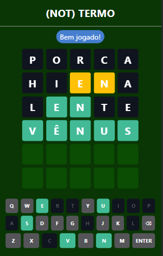

# wordle-br

A clone of Wordle made in react, [Live Demo](https://luigisouza.github.io/wordle-br/).

> Inspirations:
>
> - [Wordle](https://www.powerlanguage.co.uk/wordle/)
> - [Term.ooo](https://term.ooo/)
> - [Letreco](https://www.gabtoschi.com/letreco/)

## Instructions

The objective of the game is to guess the secret word in up to 6 attempts. Each attempt must be based on a valid Portuguese word of exactly 5 characters. After each attempt, the color of the letters in the written word will determine how close you are to the answer. When the game finishes, you can copy to clipboard the results to share with your friends. Every day, a different letter will come.

<table>
    <thead>
        <tr>
            <th>Examples</th>
            <th>Game</th>
        </tr>
    </thead>
    <tbody>
        <tr>
            <td>
              <br>
              The letter 'E' is in the word and in the correct place
            </td>
            <td rowspan=4>
               
            </td>
        </tr>
        <tr>
            <td>
              <br>
              The letter 'U' is in the word, but in the wrong place
            </td>
        </tr>
        <tr>
            <td>
              <br>
              None of the letter is in the word
            </td>
        </tr>
    </tbody>
</table>

## Getting Started

This project was bootstrapped with [Create React App](https://github.com/facebook/create-react-app).

### Requirements

- npm 7.20.5

### Running

To start the project, runs:

```bash
git clone https://github.com/LuigiSouza/wordle-br.git
cd wordle-br
npm install
npm start
```

Open [http://localhost:3000](http://localhost:3000) to view it in your browser.

The page will reload when you make changes.\
You may also see any lint errors in the console.

### Credits

Huge thanks to [Fernando Serboncini](https://github.com/fserb) for allowing the use of his list of Portuguese words, available in [here](https://github.com/fserb/pt-br)
